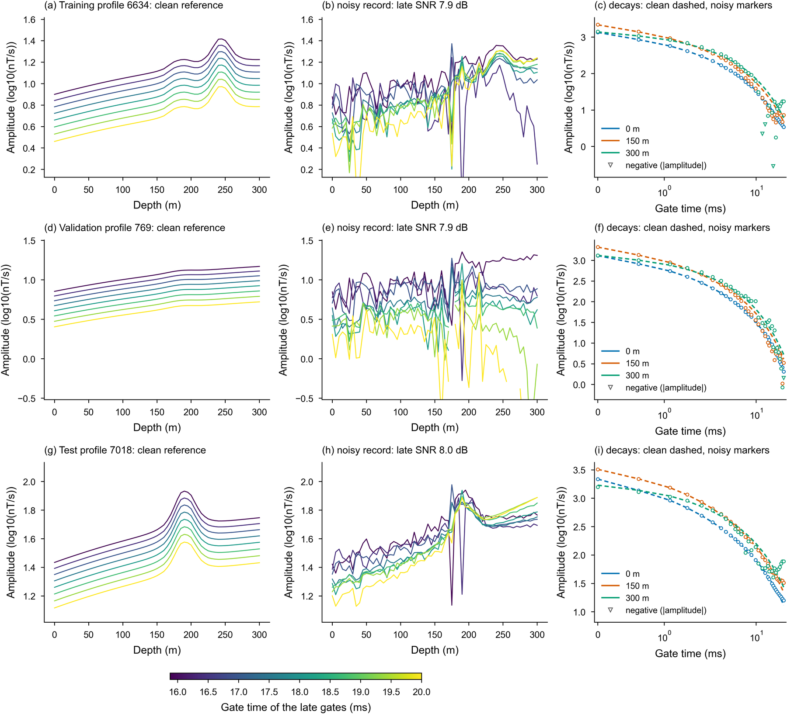

# PEBR-Net

[](https://doi.org/10.5281/zenodo.23220720)

**PEBR-Net: Depth of evidential support for concealed conductors in noise-buried late-time borehole transient
electromagnetic data**

This repository holds the code of the prior- and evidence-bounded reconstruction network (PEBR-Net) of the
manuscript *Depth of evidential support for concealed conductors in noise-buried late-time borehole transient
electromagnetic data* by Yi Ye, Chao Zhang and Nian Yu (Chongqing University). It trains, validates and tests
PEBR-Net on a paired dataset of simulated profiles (https://doi.org/10.57760/sciencedb.014t4).

## Method

PEBR-Net continues the late-time window of a borehole transient electromagnetic (BTEM) record from a
decay-consistent relaxation state and admits departures from it only where they persist across gates and remain
coherent across borehole stations. Two mechanisms act on each station and its neighborhood:

- **CDM-R** (conditional decay-manifold regeneration) maps the pooled features to a relaxation state on the grid of
  Eq. 3 and returns the baseline.
- **E-GSR** (evidence-gated structural restoration) admits departures from that baseline only on two forms of
  evidence, temporal persistence and depth consistency; the two mechanisms compose additively (Eq. 6).

Training enforces the error measures of Eq. 7 as inequality constraints through an augmented-Lagrangian scheme.
[docs/method.md](docs/method.md) maps the manuscript onto the code.

## The data

The paired dataset (https://doi.org/10.57760/sciencedb.014t4) holds simulated profiles as clean and noisy pairs in
training, validation and test files. Each profile has 61 stations from 0 to 300 m at 5 m spacing and 31 gates from 0 to 20 ms
([docs/data.md](docs/data.md)).



*One profile of each split: clean and noisy late gates along the borehole, and decays at three stations.*

## Installation

Tested with Python 3.10 and 3.14 (`requirements.txt`). For a GPU, first install the PyTorch build that matches your
CUDA (https://pytorch.org), then the rest:

```bash
git clone https://github.com/YYALD/PEBR-Net.git && cd PEBR-Net
pip install -r requirements.txt
python -m pytest -q
```

## Quick start

```bash
# 1. the data: download it from https://doi.org/10.57760/sciencedb.014t4, then copy and check the files to data/paired
python scripts/download_data.py --from <downloaded archive or folder>

# 2. read the data, build the split and run the data audits (no training; a few minutes on a CPU)
python -m pebrnet @configs/audit.args

# 3. train, test and render the figure package (a CUDA GPU is strongly recommended)
python -m pebrnet @configs/train.args

# 4. test a trained checkpoint and render the figure package without training
python -m pebrnet @configs/evaluate.args --checkpoint <checkpoint>
```

[docs/running.md](docs/running.md) explains each step, the exit codes and the options.

## Documentation

- [docs/data.md](docs/data.md): the files of the dataset and the layout for your own data.
- [docs/training.md](docs/training.md): the training parameters, the stage schedule, memory and devices.
- [docs/running.md](docs/running.md): commands, exit codes and options.
- [docs/outputs.md](docs/outputs.md): the run folders, reports and figures.
- [docs/method.md](docs/method.md): the manuscript's method and equations mapped onto the code.
- [docs/architecture.md](docs/architecture.md): the package layout.

## Repository layout

```
pebrnet/            the package (one namespace across topic files; see docs/architecture.md)
scripts/            download_data.py, train.py, evaluate_gate_loss.py
configs/            argument files: audit.args, train.args, evaluate.args, gate_loss.args
data/               README.md, sources.json, paired_content.json and paired.sha256; the dataset goes to data/paired/
tests/              pytest suite (data layout, noise model, endpoints, network, training defaults, package)
docs/               documentation
BUILD_INFO.json     version and file checksums
CITATION.cff        citation metadata (GitHub); .zenodo.json: archive metadata (Zenodo)
```

## Citation

Software (`CITATION.cff`; all versions: https://doi.org/10.5281/zenodo.23220720):

> Ye, Y., Zhang, C., & Yu, N. (2026). PEBR-Net: Depth of evidential support for concealed conductors in noise-buried
> late-time borehole transient electromagnetic data (Version V1.0.0) [Software]. Zenodo.
> https://doi.org/10.5281/zenodo.23220721

Article:

> Ye, Y., Zhang, C., & Yu, N. (2026). Depth of evidential support for concealed conductors in noise-buried late-time
> borehole transient electromagnetic data. Manuscript submitted to Journal of Geophysical Research: Solid Earth.

Data:

> Ye, Y., Zhang, C., & Yu, N. (2026). SimPEG-based synthetic three-dimensional borehole TEM dataset (Version 1)
> [Dataset]. Science Data Bank. https://doi.org/10.57760/sciencedb.014t4

## License

The code is released under the MIT License, see [LICENSE](LICENSE).
